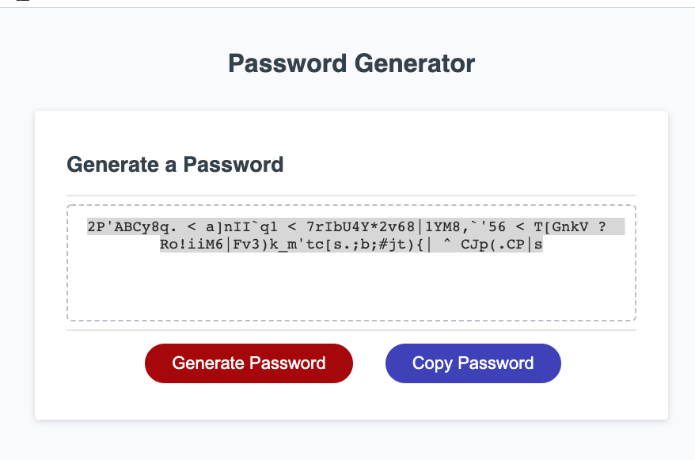

# # Homwork 03 JavaScript: Password Generator

Click on the following link to get to the application:
* ['Password-Generator GitHub IO'](https://kevkouadio.github.io/hw3-password-generator/.)

The following images demonstrates the application functionality:




### Summary
The application generates a random password based on user-selected criteria. This app runs in a browser and feature dynamically updated HTML and CSS powered by JavaScript code. It also features a clean and polished user interface and is responsive, it adapts on multiple screen sizes.

## User Story

```
AS AN employee with access to sensitive data
I WANT to randomly generate a password that meets certain criteria
SO THAT I can create a strong password that provides greater security
```

## Application features

```
Secure password:

WHEN clicked the button to generate a password,
A prompt for the length of at leat 8 characters and no more than 128 characters is displayed,
Then a series of confirm for password criterias lowercase, uppercase, numeric, and/or special characters popup,
After selected which criteria to include in the password,
The password is generated and the password is displayed in text area.
The Password can be copied to clipboard by clicking on the copy password button.

```


